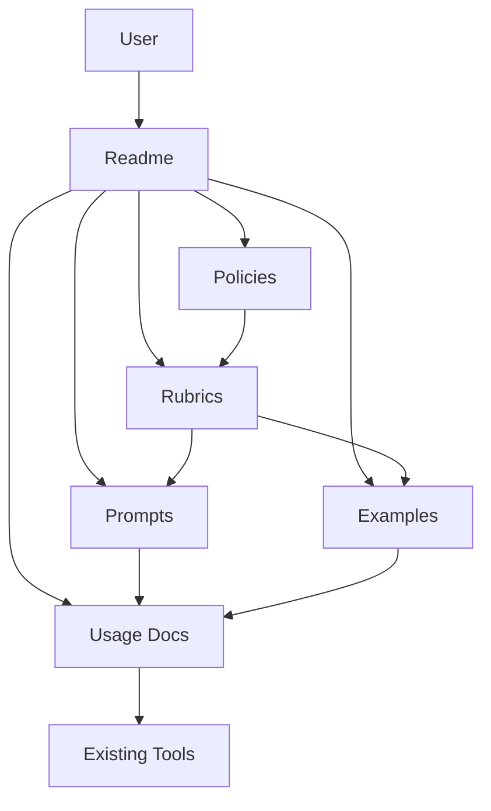
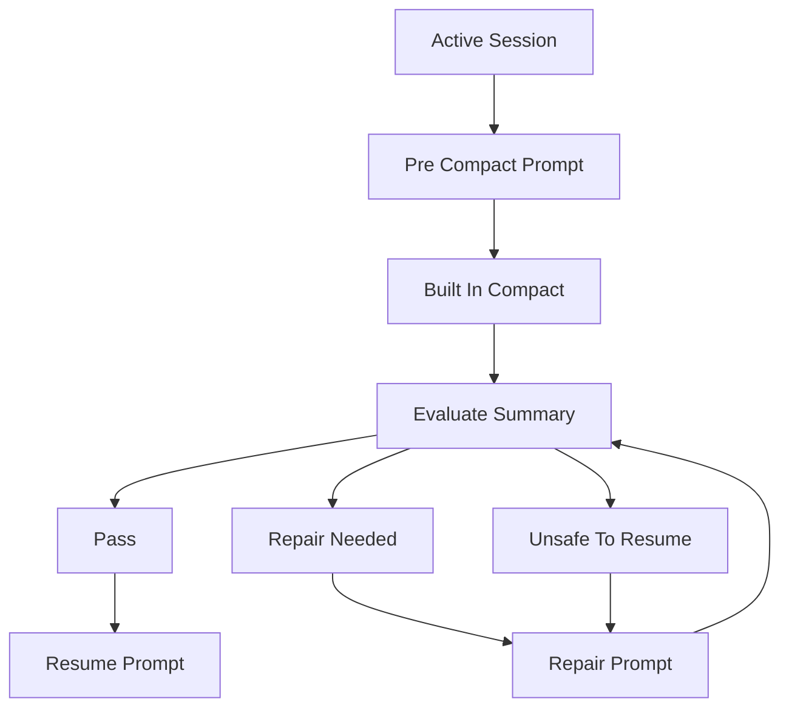

# Design Document

## Overview
compact-guard は、既存 AI コーディングエージェントの compact / compress 機能の上に重ねる documentation-first な policy / rubric layer である。この feature は runtime を持たず、Markdown policies、evaluation rubrics、prompt pack、examples、tool usage docs を OSS package として提供する。

対象ユーザーは、Codex CLI、Claude Code、Gemini CLI などで長時間の AI coding session を運用する開発者、レビュアー、OSS メンテナーである。compact-guard は compaction engine ではなく、compact 前の準備、compact 後の評価、repair、resume の判断材料を提供する。

### Goals
- compacted summary が resume に十分かを判断できる Markdown policy と rubric を提供する。
- pre-compact、post-compact evaluation、repair、resume の prompts を一貫した workflow として提供する。
- Codex CLI、Claude Code、Gemini CLI に compact-guard を適用する usage docs を提供する。
- OSS として reviewable で、runtime なしに導入できる documentation package にする。

### Non-Goals
- compact-guard は compaction 自体を実行しない。
- compact-guard は built-in compact / compress features を置き換えない。
- compact-guard は AI API、hosted service、runtime code、CLI automation を必要としない。
- compact-guard は特定 vendor、特定 model、特定 agent runtime に依存しない。

## Boundary Commitments

### This Spec Owns
- Markdown policy の情報分類: must preserve、may summarize、may drop。
- Markdown evaluation rubric の判定軸: pass、repair-needed、unsafe-to-resume。
- Prompt pack の文面: pre-compact、post-compact evaluation、repair、resume。
- Bad / good / repaired compacted-summary examples と annotation。
- Codex CLI、Claude Code、Gemini CLI への manual usage docs。
- OSS package としての navigation、contribution guidance、non-goals 表示。

### Out of Boundary
- compaction algorithm、summary generation engine、model invocation。
- AI API integration、hosted evaluator、browser extension、CLI wrapper、自動 repair tool。
- 各 vendor の compact / compress の内部挙動、出力品質、モデル選択。
- resume 後に agent が実行する code changes、tests、review outcomes。
- 将来の CI evaluator や machine-readable scoring schema。

### Allowed Dependencies
- Markdown renderer compatible な repository hosting service。
- 公式 docs への参照リンク: Codex CLI、Claude Code、Gemini CLI。
- 既存 agent の built-in compact / compress workflow を、manual user workflow の前提として参照する。
- Project-level Markdown files such as README、CONTRIBUTING、LICENSE。

### Revalidation Triggers
- compact / compress command name または workflow が Codex CLI、Claude Code、Gemini CLI の公式 docs で変わる。
- Prompt pack の契約が変わり、policy または rubric の必須項目とずれる。
- Evaluation rubric の outcome taxonomy が pass / repair-needed / unsafe-to-resume から変わる。
- Runtime code、AI API、hosted service、CLI automation を追加する提案が出る。
- Examples が tool-specific 挙動に依存し、core examples の vendor-neutral 性が崩れる。

## Architecture

### Architecture Pattern & Boundary Map
Selected pattern は Documentation Package Architecture である。Core docs を authoritative source とし、tool-specific docs は core docs を参照して既存 compact / compress workflow の前後に適用する。



**Architecture Integration**
- Selected pattern: Documentation package。runtime boundary が存在しないため、Markdown artifacts の責務と参照関係を明示する。
- Domain boundaries: core docs は vendor-neutral、usage docs は tool-specific。
- Existing patterns preserved: greenfield repository のため既存実装パターンはない。
- New components rationale: policies、rubrics、prompts、examples、usage docs は要件ごとに異なる reader intent を持つため分離する。
- Steering compliance: `.kiro/steering/` は未作成。AGENTS.md の指示に従い、spec 文書は `spec.json.language` の `ja` で記述する。

### Technology Stack

| Layer | Choice / Version | Role in Feature | Notes |
|-------|------------------|-----------------|-------|
| Documentation | Markdown | 全 MVP artifact の表現形式 | runtime なしで閲覧、review、copy 可能 |
| Repository | OSS file tree | navigation、contribution、license 表示 | hosted service ではなく source package |
| External references | Official CLI docs | usage docs の command 確認元 | implementation dependency ではない |

## File Structure Plan

### Directory Structure
```text
.
├── README.md
├── LICENSE
├── CONTRIBUTING.md
├── docs/
│   ├── index.md
│   ├── non-goals.md
│   ├── policies/
│   │   └── compaction-policy.md
│   ├── rubrics/
│   │   └── summary-evaluation.md
│   └── usage/
│       ├── codex-cli.md
│       ├── claude-code.md
│       └── gemini-cli.md
├── prompts/
│   ├── pre-compact.md
│   ├── post-compact-evaluation.md
│   ├── repair.md
│   └── resume.md
└── examples/
    ├── bad-summary.md
    ├── good-summary.md
    └── repair-walkthrough.md
```

### New Files
- `README.md` — project entry point、positioning、quick usage、navigation、non-goals summary。
- `LICENSE` — OSS license text。
- `CONTRIBUTING.md` — policy、rubric、prompt、example、usage docs の改善方法。
- `docs/index.md` — documentation map と recommended reading path。
- `docs/non-goals.md` — compact-guard が所有しないことと誤用時の読み替え guidance。
- `docs/policies/compaction-policy.md` — preserve / summarize / drop の基準と required preservation categories。
- `docs/rubrics/summary-evaluation.md` — pass / repair-needed / unsafe-to-resume の評価基準。
- `docs/usage/codex-cli.md` — Codex CLI の built-in compact workflow 周辺で compact-guard を使う手順。
- `docs/usage/claude-code.md` — Claude Code の built-in compact workflow 周辺で compact-guard を使う手順。
- `docs/usage/gemini-cli.md` — Gemini CLI の built-in compress workflow 周辺で compact-guard を使う手順。
- `prompts/pre-compact.md` — compact 前に preservation-critical context を整理する prompt。
- `prompts/post-compact-evaluation.md` — compacted summary を rubric で評価する prompt。
- `prompts/repair.md` — repair-needed または unsafe-to-resume summary を修復する prompt。
- `prompts/resume.md` — repaired or accepted summary から resume する prompt。
- `examples/bad-summary.md` — insufficient compacted summary と violation annotations。
- `examples/good-summary.md` — acceptable compacted summary と satisfied criteria annotations。
- `examples/repair-walkthrough.md` — bad summary から safer summary へ修復する annotated walkthrough。

### Modified Files
- `.kiro/specs/compact-guard/spec.json` — design generation metadata の更新のみ。

## System Flows



Key decision: compact-guard は `Built In Compact` の中身を所有しない。所有するのは、その前後で user が参照する Markdown guidance と prompt である。

## Requirements Traceability

| Requirement | Summary | Components | Interfaces | Flows |
|-------------|---------|------------|------------|-------|
| 1.1 | Markdown policy の定義 | Policy Docs | Markdown artifact | Documentation package |
| 1.2 | 必須 preservation categories | Policy Docs | Policy criteria | Documentation package |
| 1.3 | critical context と low-value detail の区別 | Policy Docs | Policy criteria | Documentation package |
| 1.4 | safe resume への影響説明 | Policy Docs | Policy rationale | Documentation package |
| 1.5 | model-agnostic and vendor-neutral language | Policy Docs, Non Goals Docs | Boundary language | Documentation package |
| 2.1 | Markdown rubric | Rubric Docs | Rubric criteria | Evaluation flow |
| 2.2 | pass repair-needed unsafe-to-resume outcomes | Rubric Docs | Outcome taxonomy | Evaluation flow |
| 2.3 | coverage dimensions | Rubric Docs | Evaluation checklist | Evaluation flow |
| 2.4 | missing required context classification | Rubric Docs | Failure criteria | Evaluation flow |
| 2.5 | AI API hosted vendor evaluator 不要 | Rubric Docs, Non Goals Docs | Boundary language | Documentation package |
| 3.1 | pre-compact prompt | Prompt Pack | Prompt contract | Compact workflow |
| 3.2 | post-compact evaluation prompt | Prompt Pack | Prompt contract | Evaluation flow |
| 3.3 | repair prompt | Prompt Pack | Prompt contract | Repair loop |
| 3.4 | resume prompt | Prompt Pack | Prompt contract | Resume flow |
| 3.5 | existing tool as compaction engine | Prompt Pack, Usage Docs | Boundary language | Compact workflow |
| 4.1 | bad and good examples | Examples | Example annotation | Documentation package |
| 4.2 | criteria satisfaction and violation annotations | Examples | Example annotation | Documentation package |
| 4.3 | missing context safety examples | Examples | Failure annotation | Documentation package |
| 4.4 | repaired example | Examples | Repair walkthrough | Repair loop |
| 4.5 | tool-neutral examples | Examples, Usage Docs | Boundary language | Documentation package |
| 5.1 | Codex CLI guide | Usage Docs | Tool guide | Compact workflow |
| 5.2 | Claude Code guide | Usage Docs | Tool guide | Compact workflow |
| 5.3 | Gemini CLI guide | Usage Docs | Tool guide | Compact workflow |
| 5.4 | prompt placement around existing workflow | Usage Docs, Prompt Pack | Tool guide | Compact workflow |
| 5.5 | no replacement claim | Usage Docs, Non Goals Docs | Boundary language | Documentation package |
| 6.1 | Markdown without execution | Repository Docs | Markdown artifact | Documentation package |
| 6.2 | navigation | Repository Docs | Navigation contract | Documentation package |
| 6.3 | MVP scope and non-goals visible | Repository Docs, Non Goals Docs | Boundary language | Documentation package |
| 6.4 | contribution guidance | Repository Docs | Contribution contract | Documentation package |
| 6.5 | manual adoption without hosted service | Repository Docs, Usage Docs | Adoption guidance | Documentation package |
| 7.1 | does not perform compaction | Non Goals Docs | Boundary statement | Documentation package |
| 7.2 | does not replace built-in features | Non Goals Docs | Boundary statement | Documentation package |
| 7.3 | does not require AI APIs | Non Goals Docs | Boundary statement | Documentation package |
| 7.4 | does not provide hosted service | Non Goals Docs | Boundary statement | Documentation package |
| 7.5 | no one vendor or model dependency | Non Goals Docs | Boundary statement | Documentation package |
| 7.6 | redirect compaction-engine misuse | Non Goals Docs, Usage Docs | Misuse guidance | Documentation package |

## Components and Interfaces

| Component | Domain | Intent | Req Coverage | Key Dependencies | Contracts |
|-----------|--------|--------|--------------|------------------|-----------|
| Repository Docs | OSS package | Entry point、navigation、contribution guidance | 6.1, 6.2, 6.3, 6.4, 6.5 | All docs P0 | Markdown |
| Non Goals Docs | Boundary | Non-goals and portability boundaries | 1.5, 2.5, 5.5, 7.1, 7.2, 7.3, 7.4, 7.5, 7.6 | README P0, Usage Docs P0 | Markdown |
| Policy Docs | Core guidance | Preservation policy and context classification | 1.1, 1.2, 1.3, 1.4, 1.5 | Non Goals Docs P1 | Markdown |
| Rubric Docs | Evaluation | Summary scoring and outcomes | 2.1, 2.2, 2.3, 2.4, 2.5 | Policy Docs P0 | Markdown |
| Prompt Pack | Workflow prompts | Prompts for prepare evaluate repair resume | 3.1, 3.2, 3.3, 3.4, 3.5 | Policy Docs P0, Rubric Docs P0 | Markdown |
| Examples | Learning artifacts | Bad good repaired summary examples | 4.1, 4.2, 4.3, 4.4, 4.5 | Policy Docs P0, Rubric Docs P0 | Markdown |
| Usage Docs | Tool guides | Codex Claude Gemini manual workflows | 5.1, 5.2, 5.3, 5.4, 5.5, 6.5, 7.6 | Prompt Pack P0, Official docs P1 | Markdown |

### Documentation Layer

#### Repository Docs

| Field | Detail |
|-------|--------|
| Intent | compact-guard の入口、導入判断、navigation、contribution guidance を提供する |
| Requirements | 6.1, 6.2, 6.3, 6.4, 6.5 |

**Responsibilities & Constraints**
- `README.md` は compact-guard が policy / rubric layer であることを最初に示す。
- `docs/index.md` は policies、rubrics、prompts、examples、usage docs への読み順を示す。
- `CONTRIBUTING.md` は docs 変更の review points を明示する。

**Dependencies**
- Inbound: User — project entry point として参照する。P0。
- Outbound: All docs — navigation target として参照する。P0。
- External: Repository hosting Markdown renderer — Markdown 表示。P2。

**Contracts**: Markdown
- Preconditions: user が repository を閲覧できる。
- Postconditions: user が MVP scope、non-goals、次に読む artifact を判断できる。
- Invariants: runtime、AI API、hosted service を必須要件として記述しない。

#### Non Goals Docs

| Field | Detail |
|-------|--------|
| Intent | compact-guard の責務境界と portability guarantee を明示する |
| Requirements | 1.5, 2.5, 5.5, 7.1, 7.2, 7.3, 7.4, 7.5, 7.6 |

**Responsibilities & Constraints**
- `docs/non-goals.md` は compaction engine ではないこと、built-in features を置き換えないこと、AI API や hosted service を必要としないことを明示する。
- 誤用 guidance は「compact-guard で compact する」ではなく「既存 compact / compress の前後に適用する」へ読み替える。

**Dependencies**
- Inbound: README、Usage Docs、Prompt Pack — boundary statement を参照する。P0。
- Outbound: Existing tool docs — built-in workflow の存在確認として参照する。P1。

**Contracts**: Markdown
- Preconditions: user が compact-guard の採用可否を評価している。
- Postconditions: user が compact-guard の non-goals と依存しないものを説明できる。
- Invariants: vendor-neutral、model-agnostic、manual-first。

#### Policy Docs

| Field | Detail |
|-------|--------|
| Intent | compact 前後で保持すべき session context を分類する |
| Requirements | 1.1, 1.2, 1.3, 1.4, 1.5 |

**Responsibilities & Constraints**
- `docs/policies/compaction-policy.md` は `must preserve`、`may summarize`、`may drop` の三分類を authoritative に定義する。
- 必須項目には intent、task status、constraints、decisions、unresolved questions、risks、modified files、commands run、verification results、pending next steps を含める。
- 各 must-preserve 項目には safe resume に必要な理由を添える。

**Dependencies**
- Inbound: Rubric Docs、Prompt Pack、Examples — criteria source として参照する。P0。
- Outbound: Non Goals Docs — vendor-neutral language を維持する。P1。

**Contracts**: Markdown
- Preconditions: user が compact 前、または compacted summary review 前に policy を参照する。
- Postconditions: user が情報を preserve、summarize、drop に分類できる。
- Invariants: tool-specific command や model behavior に依存しない。

#### Rubric Docs

| Field | Detail |
|-------|--------|
| Intent | compacted summary の resume safety を評価する |
| Requirements | 2.1, 2.2, 2.3, 2.4, 2.5 |

**Responsibilities & Constraints**
- `docs/rubrics/summary-evaluation.md` は pass、repair-needed、unsafe-to-resume の outcome taxonomy を定義する。
- 評価軸は intent、scope、state、constraints、evidence、risks、next actions を含める。
- AI API や hosted evaluator を使わず、人間または既存 agent が手動で適用できる記述にする。

**Dependencies**
- Inbound: Prompt Pack、Examples、Usage Docs — evaluation source として参照する。P0。
- Outbound: Policy Docs — preserve criteria の authoritative source。P0。

**Contracts**: Markdown
- Preconditions: compacted summary が存在する。
- Postconditions: user が pass、repair-needed、unsafe-to-resume のいずれかを判断できる。
- Invariants: outcome は observable criteria に基づき、特定 model の内的判断に依存しない。

#### Prompt Pack

| Field | Detail |
|-------|--------|
| Intent | compact workflow の各段階で再利用可能な prompts を提供する |
| Requirements | 3.1, 3.2, 3.3, 3.4, 3.5 |

**Responsibilities & Constraints**
- `prompts/pre-compact.md` は active agent に preservation-critical context の整理を求める。
- `prompts/post-compact-evaluation.md` は rubric に基づく summary evaluation を求める。
- `prompts/repair.md` は不足文脈を補った safer summary の作成を求める。
- `prompts/resume.md` は accepted summary から constraints、risks、next steps を尊重して再開するよう求める。

**Dependencies**
- Inbound: Usage Docs — workflow step として参照する。P0。
- Outbound: Policy Docs、Rubric Docs、Non Goals Docs — prompt の評価基準と境界を参照する。P0。

**Contracts**: Markdown
- Preconditions: user が prompt を既存 agent または review workflow に貼り付けられる。
- Postconditions: user が compact lifecycle の各段階で一貫した instruction を使える。
- Invariants: prompt は compact-guard が compaction engine であると表現しない。

#### Examples

| Field | Detail |
|-------|--------|
| Intent | compacted summary quality を concrete に示す |
| Requirements | 4.1, 4.2, 4.3, 4.4, 4.5 |

**Responsibilities & Constraints**
- `examples/bad-summary.md` は不足した compacted summary と violation annotations を示す。
- `examples/good-summary.md` は acceptable summary と satisfied criteria annotations を示す。
- `examples/repair-walkthrough.md` は bad summary を safer summary に変える過程を示す。
- Core examples は tool-neutral に保つ。

**Dependencies**
- Inbound: README、Rubric Docs、Usage Docs — learning material として参照する。P1。
- Outbound: Policy Docs、Rubric Docs — annotation criteria として参照する。P0。

**Contracts**: Markdown
- Preconditions: user が compacted summary の品質差を学びたい。
- Postconditions: user が missing intent、missing state、missing evidence、missing risk の問題を識別できる。
- Invariants: examples は特定 vendor の compact output を保証しない。

#### Usage Docs

| Field | Detail |
|-------|--------|
| Intent | Codex CLI、Claude Code、Gemini CLI で compact-guard を手動適用する |
| Requirements | 5.1, 5.2, 5.3, 5.4, 5.5, 6.5, 7.6 |

**Responsibilities & Constraints**
- `docs/usage/codex-cli.md` は Codex CLI の built-in compact workflow の前後に prompts と rubric を配置する。
- `docs/usage/claude-code.md` は Claude Code の built-in compact workflow の前後に prompts と rubric を配置する。
- `docs/usage/gemini-cli.md` は Gemini CLI の built-in compress workflow の前後に prompts と rubric を配置する。
- 各 guide は compact-guard が built-in feature を置き換えないことを明記する。

**Dependencies**
- Inbound: User — tool-specific adoption path として参照する。P0。
- Outbound: Prompt Pack、Rubric Docs、Non Goals Docs — workflow steps と boundary statements。P0。
- External: Official CLI docs — command name と workflow reference。P1。

**Contracts**: Markdown
- Preconditions: user が対象 CLI の既存 compact / compress workflow を使える。
- Postconditions: user が pre-compact、post-compact evaluation、repair、resume を manual workflow に差し込める。
- Invariants: guide は vendor-specific API や automation を要求しない。

## Data Models

### Domain Model
- **Policy Category**: `must preserve`、`may summarize`、`may drop`。
- **Preservation Item**: intent、task status、constraints、decisions、unresolved questions、risks、modified files、commands run、verification results、pending next steps。
- **Evaluation Outcome**: `pass`、`repair-needed`、`unsafe-to-resume`。
- **Prompt Stage**: `pre-compact`、`post-compact-evaluation`、`repair`、`resume`。
- **Example Type**: `bad`、`good`、`repaired`。

### Logical Data Model
この MVP は persistent application data を持たない。上記 domain concepts は Markdown sections、headings、tables、checklists として表現される。

**Consistency & Integrity**
- Rubric criteria は policy の required preservation categories と整合する。
- Prompt pack は policy と rubric の用語を再利用する。
- Examples annotation は rubric outcomes と policy categories を参照する。
- Usage docs は core docs を複製せず、参照して適用順序を説明する。

## Error Handling

### Error Strategy
runtime error handling は存在しない。MVP の failure mode は documentation misuse、scope drift、stale tool guidance として扱う。

### Error Categories and Responses
- **Misuse**: user が compact-guard を compaction engine として扱う場合、`docs/non-goals.md` と usage docs が policy / rubric layer としての使い方へ戻す。
- **Incomplete Evaluation**: user が required context omission を見落とす場合、rubric が repair-needed または unsafe-to-resume への分類を促す。
- **Stale Tool Guidance**: CLI command や behavior が公式 docs とずれた場合、usage docs の公式リンク確認を revalidation trigger とする。
- **Scope Drift**: contributor が runtime、AI API、hosted service、automation を追加しようとする場合、CONTRIBUTING と non-goals が別 spec 化を促す。

## Testing Strategy

### Documentation Review Tests
- Verify `docs/policies/compaction-policy.md` covers 1.1, 1.2, 1.3, 1.4, 1.5 and includes all required preservation categories.
- Verify `docs/rubrics/summary-evaluation.md` covers 2.1, 2.2, 2.3, 2.4, 2.5 and has observable pass、repair-needed、unsafe-to-resume criteria.
- Verify each prompt file maps to exactly one prompt stage from 3.1, 3.2, 3.3, 3.4 and preserves the boundary in 3.5.
- Verify `examples/` includes bad、good、repair walkthrough artifacts and each annotation references policy or rubric criteria for 4.1, 4.2, 4.3, 4.4, 4.5.
- Verify tool usage docs exist for Codex CLI、Claude Code、Gemini CLI and explain prompt placement around existing workflows for 5.1, 5.2, 5.3, 5.4, 5.5.

### Boundary Review Tests
- Verify README and `docs/non-goals.md` explicitly state 7.1, 7.2, 7.3, 7.4, 7.5.
- Verify no MVP document instructs users to run compact-guard as a compaction engine.
- Verify no MVP document requires AI API keys, hosted accounts, runtime services, package installation, or CLI automation.
- Verify tool-specific docs reference existing compact / compress features as upstream workflows, not compact-guard-owned behavior.

### Link and Navigation Tests
- Verify README links to docs index, policies, rubrics, prompts, examples, usage docs, non-goals, and contribution guidance.
- Verify `docs/index.md` provides a complete reading path for manual adoption without hosted service.
- Verify official CLI reference links in usage docs are present and reviewable.

### Contribution Review Tests
- Verify `CONTRIBUTING.md` explains acceptable changes for policies, rubrics, prompts, examples, and usage docs.
- Verify contribution guidance tells maintainers to treat runtime code、AI API integration、hosted service、CLI automation as out of MVP scope.

## Security Considerations
- compact-guard does not collect, store, transmit, or process session data.
- Prompts and examples must remind users not to disclose secrets or private repository details unnecessarily when preparing compacted summaries.
- Usage docs must not ask users to paste sensitive content into a hosted compact-guard service because no such service exists in the MVP.

## Performance & Scalability
- Runtime performance targets are not applicable.
- Documentation should remain readable and navigable as Markdown; if future content growth makes the README too large, `docs/index.md` remains the navigation source and README stays an entry point.
